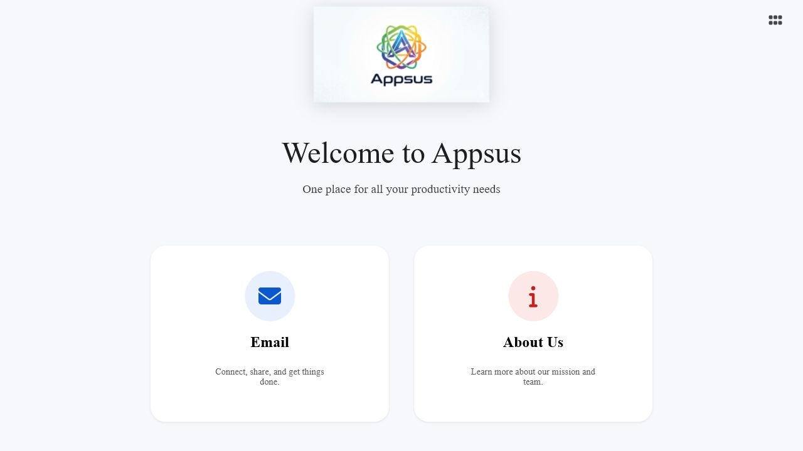
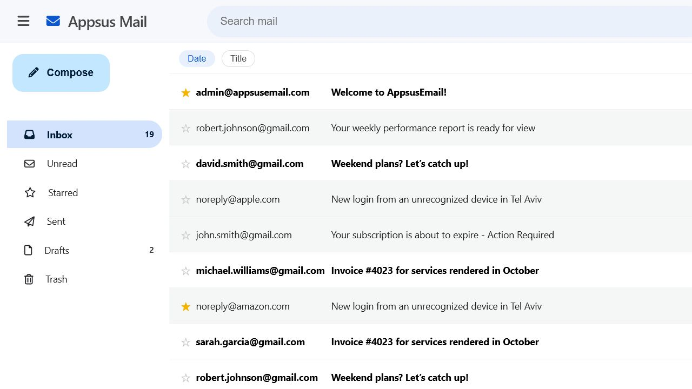

# Appsus

[](LICENSE)
[](#project-status)
[](https://aviad-benhamo.github.io/ca-appsus/)

## Project Status

`ca-appsus` is an archived Coding Academy static React project and is currently **Experimental / Not Ready**.

The repository does not currently use a package manager, build pipeline, or automated test runner. The recommended first tagged release is `v0.1.0` only after the GRS baseline, validation workflow, README alignment, and final GRS audit are complete.

## Overview

Appsus is a static single-page React application that bundles a small productivity-themed experience around a Gmail-inspired mail client.

The current public demo focuses on:

- a landing page
- an about page
- a mail module with local demo data and responsive navigation

Canonical repository:

`https://github.com/aviad-benhamo/ca-appsus`

## Features

- HashRouter-based SPA that works on GitHub Pages without server-side routing.
- Mail workflow with inbox, sent, drafts, starred, and trash views.
- Search, unread filtering, and date/title sorting in the mail module.
- Compose, auto-save draft, star, read, and trash actions backed by local storage.
- Responsive layout with a mobile-friendly header, drawer, and mail sidebar.
- Shared styling, utilities, and service helpers for static browser execution.
- Scaffolded `apps/note/` module kept in the repository for archival completeness, but not enabled in the current routed demo.

## Screenshots / Demo

Live demo:

[https://aviad-benhamo.github.io/ca-appsus/](https://aviad-benhamo.github.io/ca-appsus/)

Home screen:



Mail screen:



Primary logo:


## Quick Start

### Prerequisites

- Modern desktop or mobile browser
- Local static server such as VS Code Live Server or Python's built-in HTTP server

### Clone

```bash
git clone https://github.com/aviad-benhamo/ca-appsus.git
cd ca-appsus
```

### Run Locally

Use a static server from the repository root. Examples:

```bash
python -m http.server 5500
```

Or open the folder in VS Code and serve `index.html` with Live Server.

After the server starts, open the app through the served URL rather than a `file://` path.

## Configuration

This repository currently has no `.env` workflow and no runtime secret configuration.

- Frontend libraries are loaded from repository-managed files under `lib/`.
- Some third-party assets are referenced directly from public URLs in `index.html`.
- The canonical public deployment target is `https://aviad-benhamo.github.io/ca-appsus/`.
- The old `/Appsus/` GitHub Pages path should not be used in documentation or release material.

For dependency and validation details, see:

- [docs/dependency-policy.md](docs/dependency-policy.md)
- [docs/validation.md](docs/validation.md)
- [SECURITY.md](SECURITY.md)

## Design Principles

- Preserve the static-app architecture unless a separate approved issue changes it.
- Keep maintenance changes narrow and reviewable because this is an archived learning project.
- Prefer repository-managed documentation and explicit manual validation over speculative tooling changes.
- Keep GitHub Pages compatibility through hash-based routing and static assets.

## Project Structure

```text
ca-appsus/
|-- apps/
|   |-- mail/
|   |   |-- cmps/
|   |   |-- pages/
|   |   `-- services/
|   `-- note/
|       |-- cmps/
|       |-- pages/
|       `-- services/
|-- assets/
|   |-- css/
|   |-- fonts/
|   |-- images/
|   |-- logo/
|   `-- screenshots/
|-- cmps/
|-- docs/
|-- lib/
|-- pages/
|-- services/
|-- app.js
|-- RootCmp.jsx
`-- index.html
```

## Architecture

- `app.js` bootstraps the React root into `index.html`.
- `RootCmp.jsx` wires the app through `ReactRouterDOM.HashRouter`.
- `pages/` contains shared top-level routes such as `Home` and `About`.
- `apps/mail/` contains the active feature module, including route components, local data services, and mail-specific UI.
- `apps/note/` is present as an archived scaffold but is not currently mounted in the router.
- `cmps/` and `services/` provide shared UI and utility helpers across the static app.

## Development

There is currently no package-manager workflow, no build command, and no automated test command.

Recommended development workflow:

1. Serve the repository with a local static server.
2. Make changes without introducing a new framework or build pipeline unless an approved issue explicitly requires it.
3. Re-run the manual validation checklist after routing, asset, dependency, or documentation changes.

Reference documents:

- [docs/validation.md](docs/validation.md)
- [docs/release-process.md](docs/release-process.md)
- [docs/dependency-policy.md](docs/dependency-policy.md)

## AI Notice

AI-assisted changes in this repository should follow the tracked repository rules in [AGENTS.md](AGENTS.md).

Important expectations include:

- chat with Aviad in Hebrew
- keep code, documentation, commit messages, and technical artifacts in English
- do not push directly to `main`
- keep scope narrow
- document the validation that was actually performed

## Roadmap

See [ROADMAP.md](ROADMAP.md) for the current documentation and release-readiness priorities.

## Changelog

Pending work is tracked under [`[Unreleased]` in CHANGELOG.md](CHANGELOG.md).

## License

This project is available under the [MIT License](LICENSE).
